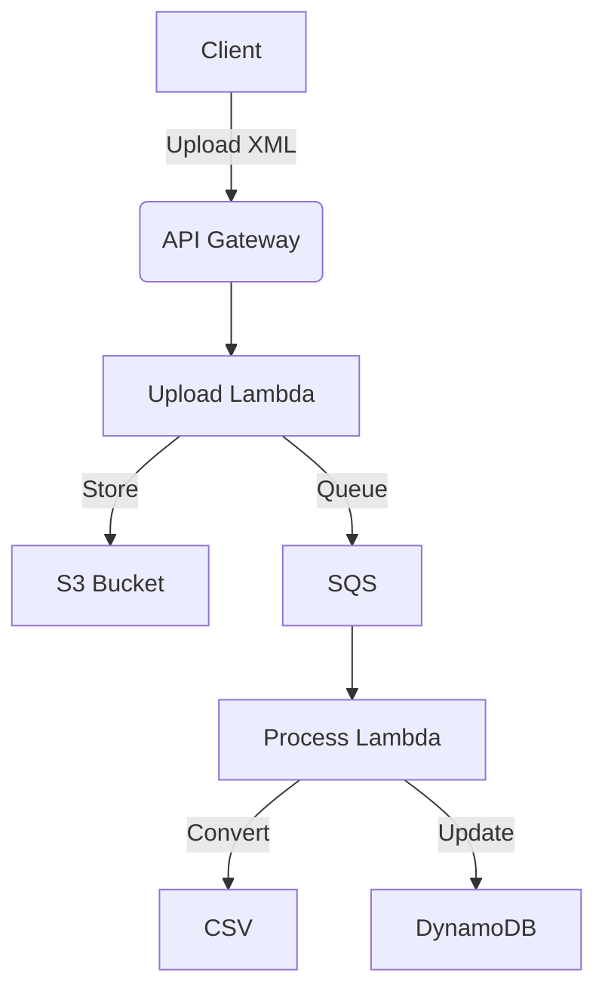

# NotaCSV

A serverless API that converts XML NFe (Nota Fiscal Eletrônica) files into structured CSV format.

## Features

- **XML to CSV Conversion**: Transforms Brazilian electronic invoice XMLs to CSV
- **Serverless Architecture**: AWS Lambda, S3, SQS, DynamoDB
- **Batch Processing**: Handles up to 5 files per request
- **Status Tracking**: Real-time processing status updates at DynamoDB

## Tech Stack

- **Language:** Javascript (Node.js 20.x)
- **Architecture:** Serveless (AWS Lambda)
- **Storage**: S3
- **Queue**: SQS
- **Database:** DynamoDB
- **Mailing**: SES

## Getting Started

### Prerequisites
- AWS account
- Node.js 20.x
- Serverless Framework (`npm install -g serverless` or `npx serverless`)

### Run Locally with LocalStack

Run the **entire stack** (S3, SQS, DynamoDB, Lambda, SES) locally in Docker, no AWS account needed. Requires Docker.

LocalStack Community does not emulate API Gateway v2 (`httpApi`), so the HTTP layer is provided by `serverless-offline` running on the host. The handlers it runs read `AWS_ENDPOINT_URL=http://localhost:4566` from `infra/config.js` and hit LocalStack for S3 / SQS / DynamoDB / SES.

```bash
# 1. Start LocalStack
npm run localstack:up

# 2. Dummy AWS credentials (LocalStack ignores their value)
export AWS_ACCESS_KEY_ID=test
export AWS_SECRET_ACCESS_KEY=test
export AWS_DEFAULT_REGION=us-east-1

# 3. Verify the sender identity so SES accepts the send
aws --endpoint-url=http://localhost:4566 ses verify-email-identity \
  --email-address me@scostadavid.dev

# 4. Deploy infra (buckets, tables, queue, processQueue Lambda) into LocalStack
npm run deploy:local
```

> The `org` and `app` lines in `serverless.yml` belong to the Serverless Dashboard and require login. They are commented out for offline use. Keep them commented (or run `serverless login` once) before `npm run deploy:local`.

Then start the HTTP layer and the web app in two terminals:

```bash
# Terminal A. HTTP layer (signup + upload on :3000)
npm run offline

# Terminal B. serves index.html on :8080 with hot reload
npm run front
```

Open http://localhost:8080 in the browser. The flow:

1. **Signup card** -> `POST localhost:3000/signup` -> API key is stored in `localStorage`.
2. **Upload card** -> `POST localhost:3000/upload` with `x-api-key` -> handler stores the XMLs in LocalStack S3, enqueues a message to LocalStack SQS, and the `processQueue` Lambda (running inside LocalStack from `deploy:local`) generates the CSV and the SES email.

The async result lives entirely inside the LocalStack container:

```bash
# Generated CSV
aws --endpoint-url=http://localhost:4566 \
  s3 ls s3://processed-csv-bucket-local-nfe --recursive

# Emails LocalStack captured (never sent to a real inbox)
curl http://localhost:4566/_aws/ses

# Processing status
aws --endpoint-url=http://localhost:4566 \
  dynamodb scan --table-name processing-status-table-local-nfe
```

> The CSV download link in the captured email points to the LocalStack hostname seen from inside the Lambda container. Swap the host for `localhost` to open it from your browser.

`npm run test:local` is an alternative that skips the HTTP layer and invokes the deployed Lambdas directly with API-Gateway-shaped events, useful in CI.

Stop everything with `npm run localstack:down` (also `Ctrl+C` the two foreground processes). The LocalStack container has no persistent volume, so all data evaporates with it.

### Dev against AWS

`npx serverless dev` runs the function locally but tunnels requests to a real AWS dev stack (it is not fully offline). Use LocalStack above for offline work.

### Deployment

```bash
git clone https://github.com/scostadavid/notacsv.git
cd notacsv
npm install
npx serverless deploy
```

Before shipping the web app, point `API_BASE_URL` in `index.html` at the `httpApi` endpoint printed by `serverless deploy` (instead of `http://localhost:3000`).

## API Reference

### Sign Up (get an API key)

```bash
POST /signup
Content-Type: application/json

Body:
- email: string (required)
```

Returns an API key for that email. Calling it again with the same email returns the existing key.

```bash
curl -X POST \
  -H "Content-Type: application/json" \
  -d '{"email":"user@example.com"}' \
  https://[api-url]/signup
# => { "apiKey": "..." }
```

### Upload Files

Requires the `x-api-key` header. Each upload counts against a monthly quota (`MONTHLY_LIMIT`, default 100 requests/month).

```bash
POST /upload
Content-Type: multipart/form-data
x-api-key: <your-api-key>

Params:
- email: string (required). Address that will receive the CSV
- files: XML files (max 5, .xml only)
```

#### Example
```bash
curl -X POST \
  -H "x-api-key: YOUR_API_KEY" \
  -F "email=user@example.com" \
  -F "files=@nota1.xml" \
  -F "files=@nota2.xml" \
  https://[api-url]/upload
```

Responses: `401` missing key, `403` invalid key, `429` monthly quota exceeded.


### Architecture



## Roadmap

- [x] Nfe XML batch upload
- [x] Nfe XML to CSV spreadsheet processing
- [x] Send data by e-mail (SES)
- [x] Web app (`index.html`)
- [x] API authentication (API key + monthly quota)
- [ ] Public deployment

## Email delivery (SES)

Processed CSVs are emailed to the user via Amazon SES with a presigned download link. By default SES is in **sandbox mode**: it only sends to and from **verified** identities. Before testing end-to-end, verify the address in `FROM_EMAIL` (sender) and the recipient address in the SES console of your region, or test with the same verified address for both.

## Project Structure

```bash
├── handlers/              # Lambda entry points
│   ├── uploadNfeBatch.js  # POST /upload. auth + quota + enqueue
│   ├── signup.js          # POST /signup. issue API key
│   └── processQueue.js    # SQS handler. XML to CSV + email
├── services/              # Business logic
│   ├── uploadNfeBatch.js  # store XMLs, record status, queue job
│   └── signup.js          # API key issuing
├── lib/
│   ├── nfe.js             # XML parsing and CSV conversion
│   └── usage.js           # monthly quota counter
├── infra/                 # AWS SDK clients (s3, sqs, dynamo, ses)
├── utils/parseMultipart.js # multipart/form-data parsing
├── index.html             # web app (signup + upload)
├── serverless.yml         # infrastructure as code
```

## Author

- **David S. Costa**
  [Email](mailto:me@scostadavid.dev) • [GitHub](https://github.com/scostadavid) • [Website](https://scostadavid.dev) • [LinkedIn](https://linkedin.com/in/scostadavid)

---

> This project is actively evolving. Feedback and ideas are welcome.
